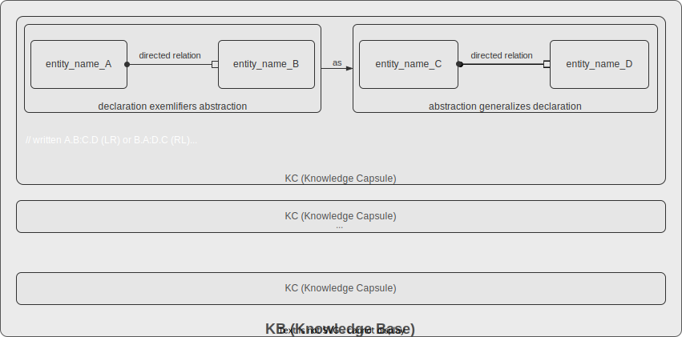

# Abstract Language repo

> Formal language for personal relational knowledge.  
> One expression. Two operators. Three act families.

---

## Purpose of language
Abstract Language (abstractlang) is for reflexing, sharing, joining, and contesting personal relational knowledge and for describing architecture of worlds. 

## Core syntax

Rules for forming valid expressions. Two operators, total:
- **.**	relation operator	binds two concepts into a directed relation
- **:**	abstraction operator	left relation is concrete case of right more abstract relation (not similarity, not analogy, not composition)

## Semantics
The judgment lattice personally constituted by a speaker's cognitive acts; a bounded, individual reflection of abstraction structure. Each speaker holds their own semantics — no shared universal interpretation.

## Knowledge is bounded judgments
### Main expression

### Other expressions

| Family | Expressions | Purpose |
|--------|------------|---------|
| Cognitive | `reflex`, `negate`, `retract` | Constitute the BK |
| Investigative | `?pattern::pipe` | Interrogate the BK with queries, projections, etc. |
| Communicative | share, join, contest | Distribute BK between speakers in a decentralized manner|

---

### Bounded Knowledge (BK)

A **Bounded Knowledge** corpus is a personally held collection of judgments expressed as a judgment lattice - abstraction in one judgement may occur concretization in other and vice versa. This way 'lattice' is formed. Lattice is a DAG — bounded above by ultimately higest judgement`yin.yang : yin.yang` and open below to any number of concrete judgments.

---
